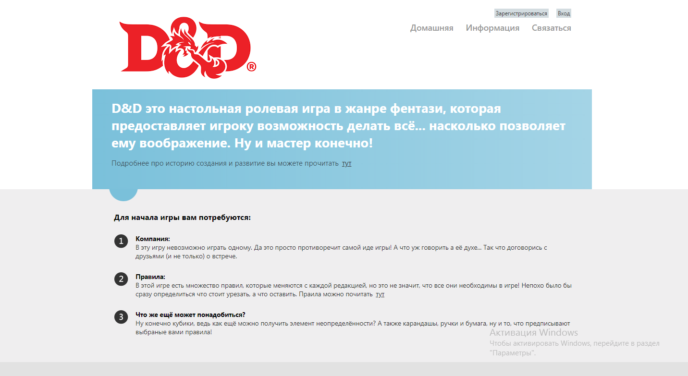
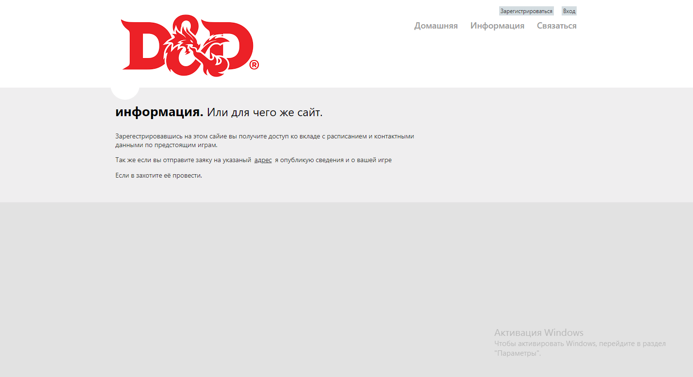
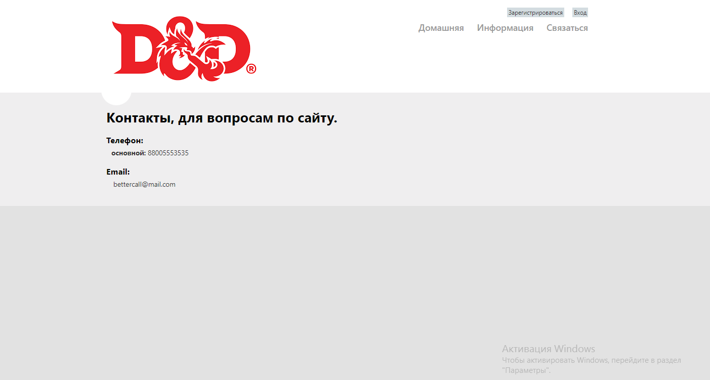
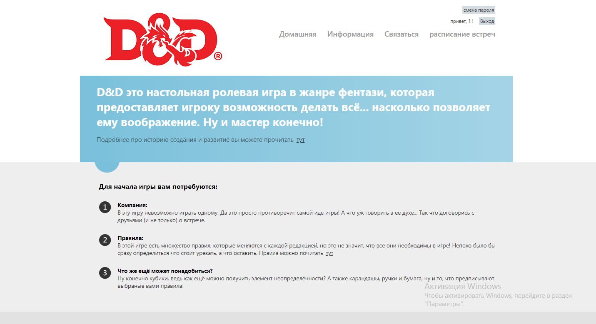
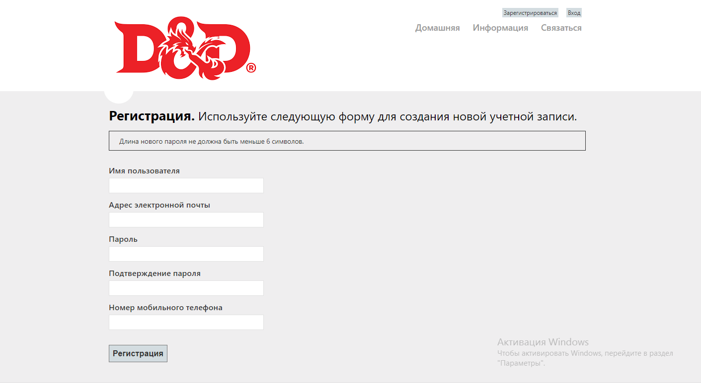
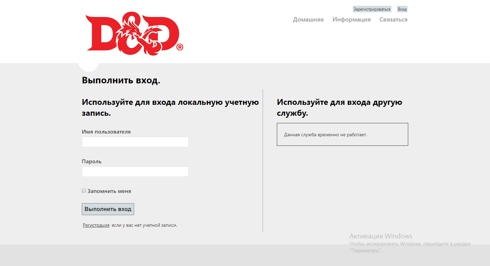
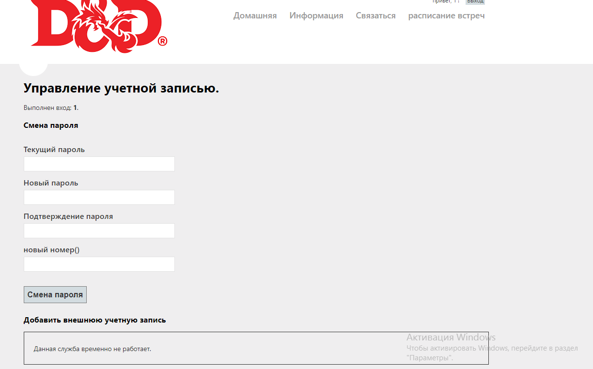
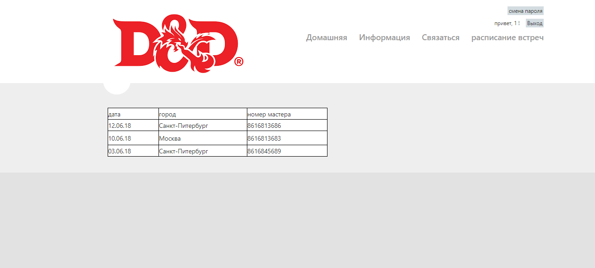

# Создание кросплотформенного сайта с помощью ASP.NET

## Оглавление
* [Введение](#ВВЕДЕНИЕ)
  * [Назначение](#НАЗНАЧЕНИЕ)
  * [Масштаб проекта](#МАСШТАБ-ПРОЕКТА)
  * [Целевая аудитория](#МАСШТАБ-ПРОЕКТА)
* [Общее описание](#ОБЩЕЕ-ОПИСАНИЕ)
  * [Описание](#ОПИСАНИЕ)
  * [Общая Функциональность](#ОБЩАЯ-ФУНКЦИОНАЛЬНОСТЬ)
    * [С точки зрения разработчиков](#С-ТОЧКИ-ЗРЕНИЯ-РАЗРАБОТЧИКОВ)
    * [С точки зрения клиента](#С-ТОЧКИ-ЗРЕНИЯ-КЛИЕНТА)
  * [Функции продукта](#ФУНКЦИИ-ПРОДУКТА)
    * [Фронтенд (сайт)](#ФРОНТЕНД-САЙТ)
    * [Бэкенд (сервер)](#БЭКЕНД-СЕРВЕР)
  * [Характеристики пользователя](#ХАРАКТЕРИСТИКИ-ПОЛЬЗОВАТЕЛЯ)
  * [Ограничения](#ОГРАНИЧЕНИЯ)
* [Детальные требования](#ДЕТАЛЬНЫЕ-ТРЕБОВАНИЯ)
  * [Требования ко внешним интерфейсам](#ТРЕБОВАНИЯ-КО-ВНЕШНИМ-ИНТЕРФЕЙСАМ)
    * [Интерфейс пользователя](#ИНТЕРФЕЙС-ПОЛЬЗОВАТЕЛЯ-САЙТ)
    * [Серверный интерфейс (API)](#СЕРВЕРНЫЙ-ИНТЕРФЕЙС-api)
  * [Функциональные требования](#ФУНКЦИОНАЛЬНЫЕ-ТРЕБОВАНИЯ)
  * [Описание возможностей](#ОПИСАНИЕ-ВОЗМОЖНОСТЕЙ)
    * [Неавторизованный пользователь](#НЕАВТОРИЗОВАННЫЙ-ПОЛЬЗОВАТЕЛЬ)
    * [Авторизованный пользователь](#АВТОРИЗОВАННЫЙ-ПОЛЬЗОВАТЕЛЬ)
  * [Системные требования](#СИСТЕМНЫЕ-ТРЕБОВАНИЯ)
  * [Перспективы развития](#ПЕРСПЕКТИВЫ-РАЗВИТИЯ)
  * [Стек технологий](#СТЕК-ТЕХНОЛОГИЙ)

## ВВЕДЕНИЕ
### НАЗНАЧЕНИЕ
Создание небольшого информативного сайта.

### МАСШТАБ ПРОЕКТА
Данный проект является независимой и самостоятельной разработкой.

### ЦЕЛЕВАЯ АУДИТОРИЯ
Целевая аудитория данного сервиса - Интернет пользователи .

## ОБЩЕЕ ОПИСАНИЕ
### ОПИСАНИЕ
Данное веб приложение представляет собой базу данных с веб интерфейсом.

### ОБЩАЯ ФУНКЦИОНАЛЬНОСТЬ
#### С ТОЧКИ ЗРЕНИЯ РАЗРАБОТЧИКОВ
* Создать базу для хранения данных пользователей и их данных;
* Создать веб интерфейс для работы с базой;

#### С ТОЧКИ ЗРЕНИЯ КЛИЕНТА
* Создать простой и удобный кросплатформенный сайт;

### ФУНКЦИИ ПРОДУКТА
#### ФРОНТЕНД (САЙТ)
* Регистрация под настоящим именем или вымышленным никнейном;
* Возможность смены параметров акаунта
* Доступ к части сайта откры только зарегестрированным пользователям

#### БЭКЕНД (СЕРВЕР)
* Сохранение полной истории всех вызовов.

### ХАРАКТЕРИСТИКИ ПОЛЬЗОВАТЕЛЯ
Пользователь с ПК или смартфоном.

### ОГРАНИЧЕНИЯ
* Управление в игре Tetris реализовано только посредством клавиатуры;
* Интерфейс сайта реализован только на английском языке.

## ДЕТАЛЬНЫЕ ТРЕБОВАНИЯ
### ТРЕБОВАНИЯ КО ВНЕШНИМ ИНТЕРФЕЙСАМ
#### ИНТЕРФЕЙС ПОЛЬЗОВАТЕЛЯ (САЙТ) 
Все страницы должны иметь вверху навигационное меню.
Также на всех страницах есть возможность регистрации, входа, выхода и изменения учётной записи.
Интерфейс пользователя представляет собой сайт, который включает в себя следующие страницы:
1. **Домашняя, информация и "связаться"**  
Содержат форму для информацию по тематике сайта и ссылку на страницу регистрации.  

2. **Страница регистрации**  
Содержит форму для регистрации.  

3. **страница авторизации, изменения параметров**  
Содержит форму для авторизации и, неожидано, изменения параметров .  

4. **Скрытая страница**  
Содержит данные предназначенные только авторизованным пользователям.  

#### СЕРВЕРНЫЙ ИНТЕРФЕЙС (UI)
1. Метод для внесения данных пользователя в базу данных и их изменения. 

### ФУНКЦИОНАЛЬНЫЕ ТРЕБОВАНИЯ
* Регистрация пользователей;
* Вход пользователей;
* Скрытие части контента;
* Изменения данных пользователей;
### ОПИСАНИЕ ВОЗМОЖНОСТЕЙ
#### НЕАВТОРИЗОВАННЫЙ ПОЛЬЗОВАТЕЛЬ
* Посещение страниц "Домашняя", "информация" и "связаться";
* Вход;
* Регистрация.

#### АВТОРИЗОВАННЫЙ ПОЛЬЗОВАТЕЛЬ
* Посещение страниц "Домашняя", "информация" и "связаться";
* Выход;
* Изменение параметров;
* Просмотр сраницы "Расписание встреч";

### СИСТЕМНЫЕ ТРЕБОВАНИЯ
* ОС: Windows, Linux, MacOS X
* CPU: 1.2Gz
* RAM: 1 Gb
* Storage: Минимум 1 Gb

### ПЕРСПЕКТИВЫ РАЗВИТИЯ
* Добавление турниров на основе вызовов;
* Добавление поиска соперников.

### СТЕК ТЕХНОЛОГИЙ
* C# для реализации бэкенда;
* HTML+CSS+с#+js для реализации фроненда;
* База данных SQL для хранения данных.
